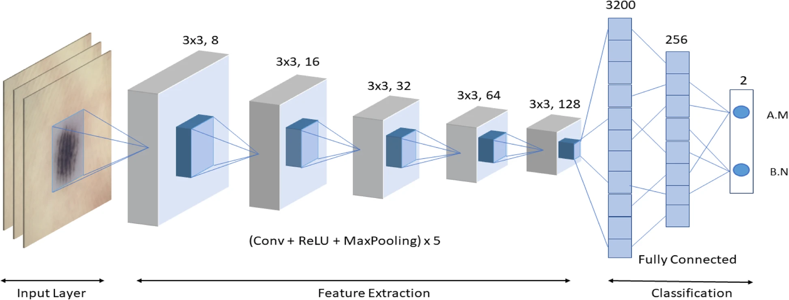
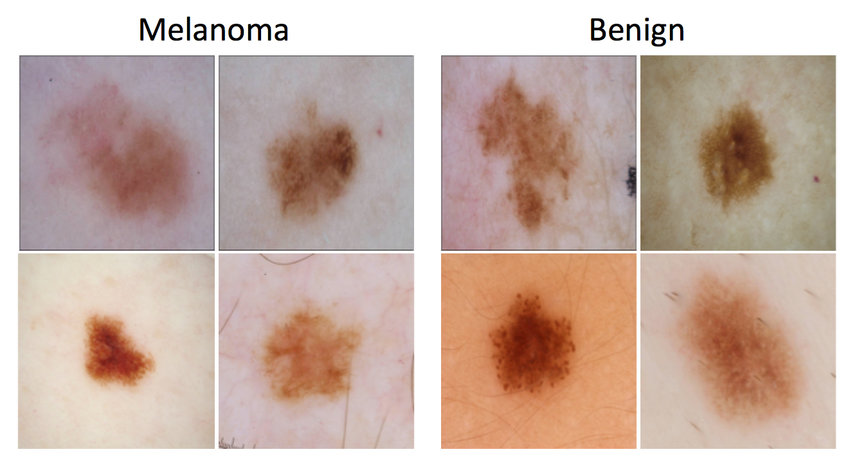
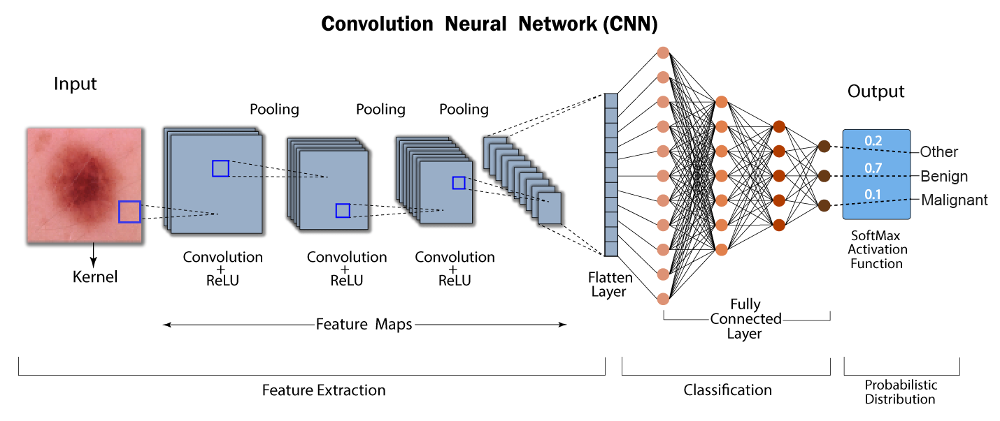
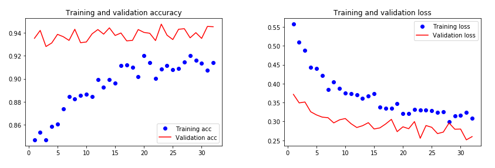

# Melanoma Detection with Deep Learning

## Sience Depth Study

### 1 - Introduction

Melanoma accounts for only 1% of skin cancers but causes a majority of skin cancer deaths (American
Cancer Society, 2019). The Australian Institute of Health and Welfare estimates over 16,878 new
melanoma cases will be diagnosed in 2021. It is also estimated that 1,315 people diagnosed with
melanoma will die from the disease. Similar to other cancers, early and correct detection can drastically
improve the effectiveness of treatment. Currently, dermatologists evaluate all skin lesions on a patient
to identify outliers that are most likely to be melanoma. Dermatologists could enhance their diagnostic
accuracy with the help of Deep Learning algorithms trained to identify Melanoma. If successful,
Dermatologists would be able to make more accurate predictions and treat patients more effectively.
Although Melanoma is a deadly disease, if detected early, the majority of skin lesions can be removed
with minor surgery. Deep Learning algorithms that automate the diagnosis of melanoma could greatly
increase a dermatologist’s accuracy. Improved melanoma detection has the potential to benefit millions
of people and save thousands of lives.

  
Figure 0: Examples of malignant and benign skin regions (ResearchGate, Example lesion classification
of dermoscopic images - Noel Codella)

### 2 - Aim

Dermatologists on average have a 67.4% to 76.1% chance of correctly predicting melanoma based
on clinical and dermoscopic images (Dermatology Practical Conceptual, 2021). The aim of this
experiment is to determine whether Deep Learning can predict melanoma with a higher accuracy than
dermatologists.

### 3 - Hypothesis

The ResNet50 Deep Learning model will be able to predict melanoma in skin lesion images with a
higher accuracy than dermatologists, due to the large training dataset and the complexity of the model.

### 4 - Variables

- Independent Variable - Number of epochs used for training the model
- Dependent Variable - Accuracy of melanoma prediction (on validation data)
- Control Variable - Accuracy of melanoma detection from human dermatologists

### 5 - Materials

A laptop with a stable internet connection, where you can run the code in a free online cloud virtual
machine like Google Collaboratory or an interactive Kaggle Notebook. For offline use a computer with
Python 3.9 or higher installed and a NVIDIA graphics card for better performance and integration
with CUDA. The dataset used is the HAM10k Dermatoscopic Image Collection from Harvard. An
augmented version is being used that balances the melanoma to non-melanoma samples using data
augmentation.

- Link to interactive notebook on Kaggle: https://www.kaggle.com/code/keypos/resnet50-melanoma-classification
- Link to augmented Kaggle dataset: https://www.kaggle.com/datasets/drscarlat/melanoma
- Link to direct source code on GitHub: https://github.com/k4yp/melanoma/blob/main/resnet50-melanoma-classification.ipynb

### 6 - Method

ResNet50 is being used as the base model. The model consists of 48 convolution layers which makes
it exceptional at image recognition and classification. The model is then trained on over 10,
augmented images from the HAM10k dataset. These images will slowly train the model in a series
of runs called epochs. In esence the model starts out with no prior knowledge and is fed one image
at a time. At the beginning the predictions are almost random. When the model predicts an image
wrong it takes that feedback and through backpropagation adjusts its parameters. At its core the
model distinguishes features of melanoma lesions leading to the accuracy of the model exponentially
increasing until it flattens off and peaks. If the model is trained for too many epochs it will start to
over-fit on the data. This is when the model becomes extremely accurate at identifying the data it has
been trained on but useless at predicting images it has not seen in training. This is a common issue in
Deep Learning so multiple runs of different epochs will be tested to find the optimal training amount.
A separate dataset of 3000 images the model has not been trained on will be used to test the models
accuracy.

  
Figure 1: Example of Convolutional Neural Network Architecture

### 7 - Results

After training for 1 epoch the model predicted melanoma on the test data with an accuracy of 88.9%.
From there the model improved as the epochs increased but still stayed relatively consistent. The
model predicted most images in a binary fashion with most samples either being 100% or 0% melanoma. The model did surpass the
initial 76.1% baseline accuracy by Dermatologists.

| Epochs | Accuracy on test data |
|--------|-----------------------|
| 1      | 88.9%                 |
| 2      | 91.3%                 |
| 4      | 91.8%                 |
| 8      | 92.4%                 |
| 16     | 92.5%                 |
| 32     | 93.2%                 |
| 64     | 93.4%                 |

### 8 - Discussion

The hypothesis was proven true with the Deep Learning model predicting melanoma with a 93.4%
accuracy compared to the 76.1% accuracy which was the baseline of dermatologists. The first area of
improvement to consider is the raw data being fed into the model. The datasets largely included lesions
from patients in specialist clinical settings, where the types of skin lesions are different to those seen
in a normal clinical setting. This could lead to a bias in detection. Another thing to consider is how
the dataset was split between training and validation. This has to be considered to avoid over-fitting.
This algorithm has great potential to support dermatologists in the accurate detection of skin lesions.
However, this type of machine learning based algorithm is at an early stage of development. Concerns
can be raised as to whether the performance would be maintained among populations with lower skin
cancer prevalence, or in settings with non-dermatoscopic and lower quality images, which is the case
for many clinics and images taken by patients. It is the end goal to have a machine learning algorithm
to assist dermatologists in accurately assessing skin lesions.

### 9 - Conclusion

The aim of this experiment was to determine whether Deep Learning can predict melanoma with a
higher accuracy than dermatologists. The hypothesis was supported with the Deep Learning model
having a significantly higher accuracy than dermatologists. The machine learning algorithm correctly
predicted 93.4% of skin lesions compared to a 76.1% accuracy with Dermatologists. Although the
results are promising Deep Learning algorithms need to be evaluated carefully to ensure that they
are accurate, effective, and safe enough for clinical analysis to not over-diagnose or under-diagnose
melanoma. We can be hopeful that in the future Deep Learning can help assist dermatologists with
melanoma detection and it becomes a commonplace practice.

### 10 - Bibliography

- Kaggle. (2020). SIIM-ISIC Melanoma Classification
    https://www.kaggle.com/competitions/siim-isic-melanoma-classification/overview
- Organokov, M. (2021) SIIM-ISIC Melanoma Classification EfficientNet
    https://www.kaggle.com/code/muhakabartay/siim-isic-melanoma-classification-
    efficientnet/notebook
- Polesie, S., Jerg ́eus, E., Gillstedt, M., Ceder, H., Dahl ́en Gyllencreutz, J., Fougelberg, J.,
    Johansson Backman, E., Pakka, J., Zaar, O. and Paoli, J. (2021). Can Dermoscopy Be Used to
    Predict if a Melanoma Is In Situ or Invasive? Dermatology Practical Conceptual
    https://www.ncbi.nlm.nih.gov/pmc/articles/PMC8172039/
- Tschandl, P., Rosendahl, C. and Kittler, H. (2018). The HAM10000 dataset, a large collection
    of multi-source dermatoscopic images of common pigmented skin lesions.
    https://www.nature.com/articles/sdata
- Tschandl, P. (2018). The HAM10000 dataset, a large collection of multi-source dermatoscopic
    images of common pigmented skin lesions.
    https://dataverse.harvard.edu/dataset.xhtml?persistentId=doi:10.7910/DVN/DBW86T
- Rasu, F., Dey, N. and Hashem, M. (2020). A Comparative Study of Neural Network
    Architectures for Lesion Segmentation and Melanoma Detection
    https://www.researchgate.net/publication/342549085-A-Comparative-Study-of-Neural-
    Network-Architectures-for-Lesion-Segmentation-and-Melanoma-Detection
- Jones, O.T., Matin, R.N., Schaar, M. van der, Bhayankaram, K.P., Ranmuthu, C.K.I., Islam,
    M.S., Behiyat, D., Boscott, R., Calanzani, N., Emery, J., Williams, H.C. and Walter, F.M.
    (2022). Artificial intelligence and machine learning algorithms for early detection of skin cancer
    in community and primary care settings: a systematic review. The Lancet Digital Health
    https://www.thelancet.com/journals/landig/article/PIIS2589-7500(22)00023-1/fulltext
- Cancer Australia (2019). Melanoma of the skin statistics.
    https://www.canceraustralia.gov.au/cancer-types/melanoma/statistics
